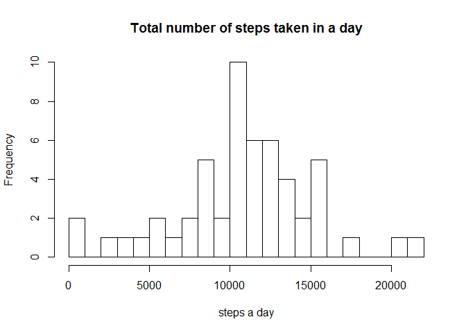

# Reproducible Research: Peer Assessment 1


## Loading and preprocessing the data
loading the data

```r
the_data <- read.csv("./activity/activity.csv")
```
Marking the rows that have missing data (NA) and creating a data.frame with complete cases only

```r
rows_NA <- is.na(the_data$steps)
the_data_noNA <- the_data[!rows_NA,]
```

## What is mean total number of steps taken per day?
Calculating the total number of steps taken each day

```r
sum_steps <- tapply(as.numeric(the_data_noNA$steps),factor(as.character(the_data_noNA$date)),sum)
```
Creating a histogram of the total number of steps taken wach day

```r
hist(sum_steps,20,main="Total number of steps taken in a day",xlab="steps a day")
```

 

The mean total number of steps taken per day is calculated:

```r
mean(sum_steps)
```

```
## [1] 10766.19
```
The median of the total number of steps taken per day is calculated:

```r
median(sum_steps)
```

```
## [1] 10765
```

## What is the average daily activity pattern?
Calculating the average across all days of the number of steps taken in each 5-minute interval

```r
mean_per_interval <- tapply(as.numeric(the_data_noNA$steps),factor(the_data_noNA$interval),mean)
```
The intervals are extracted and the plot of the average number of steps across all days as a function 
of the time intervals is prepared

```r
the_levels <- levels(factor(the_data_noNA$interval))
plot(the_levels,mean_per_interval,xlab="5-minute interval",ylab="average number of steps taken across all days",type="l")
```

 

The 5-minute interval, on average across all the days, that contains the maximum number of steps is calculated: 

```r
the_levels[mean_per_interval==max(mean_per_interval)]
```

```
## [1] "835"
```

## Imputing missing values
Returning to the original data we now create a new dataset (the_data_imput) in which we fill in all of the missing values 
in the data set with the mean of the corresponding 5-minute interval calculated over all days

```r
the_data_imput <- the_data
for (i in 1:nrow(the_data_imput)) {
	if (is.na(the_data_imput[i,1])) {
		the_data_imput[i,1]=mean_per_interval[[as.character(the_data_imput[i,3])]]
		}
	}
```
calculating the total number of steps taken each day and preparing a histogram 

```r
sum_steps_imput <- tapply(as.numeric(the_data_imput$steps),factor(as.character(the_data_imput$date)),sum)
hist(sum_steps_imput,20,main="Total number of steps taken in a day (imput data)",xlab="steps a day")
```

 

Calculating the mean of the total number of steps taken per day

```r
mean(sum_steps_imput)
```

```
## [1] 10766.19
```
Calculating the median of the total number of steps taken per day

```r
median(sum_steps_imput)
```

```
## [1] 10766.19
```
We can see that the mean remained the same and the median that was close to the mean, turned equal to the mean.
The impact of imputing missing data the way we did it was to strenghten the mean (higher frequency). 
This way the mean remains the same and the median gets closer to the mean.  

## Are there differences in activity patterns between weekdays and weekends?
Using the dataset with the filled-in missing values.
Creating a new factor variable in the dataset with two levels – “weekday” and “weekend” indicating whether 
a given date is a weekday or weekend day:

```r
Sys.setlocale("LC_TIME", "English")
```

```
## [1] "English_United States.1252"
```

```r
the_weekdays <- weekdays(strptime(as.character(the_data_imput$date),format="%Y-%m-%d"))
for (i in 1:length(the_weekdays)){
   if (the_weekdays[i]=="Sunday" |the_weekdays[i]=="Saturday") {
           the_weekdays[i]="weekend"
		} else {
           the_weekdays[i]="weekday"
 		}
	}
```
Combining the new factor variable to the data set

```r
the_data_imput_w <- cbind(the_data_imput,the_weekdays)
```
Calculating the average across weekend days of the number of steps taken in each 5-minute interval

```r
the_data_imput_we <- the_data_imput_w[the_weekdays=="weekend",]
mean_per_interval_we <- tapply(as.numeric(the_data_imput_we$steps),factor(the_data_imput_we$interval),mean)
```
Calculating the average across weekdays of the number of steps taken in each 5-minute interval

```r
the_data_imput_wd <- the_data_imput_w[the_weekdays=="weekday",]
mean_per_interval_wd <- tapply(as.numeric(the_data_imput_wd$steps),factor(the_data_imput_wd$interval),mean)
```
Creating a panel plot containing a time series plot (i.e. type = "l") of the 5-minute interval (x-axis) 
and the average number of steps taken, averaged across all weekday days or weekend days (y-axis).

```r
par(mfrow=c(2,1),mar=c(4,4,2,2),oma=c(0,0,0,0))
{plot(as.numeric(the_levels),as.numeric(mean_per_interval_we),main="weekend",ylab="Number of steps",xlab="",ylim=c(0,250),type="l") 
plot(as.numeric(the_levels),as.numeric(mean_per_interval_wd),main="weekday",ylab="Number of steps",xlab="Interval",ylim=c(0,250),type="l")
}
```

 


